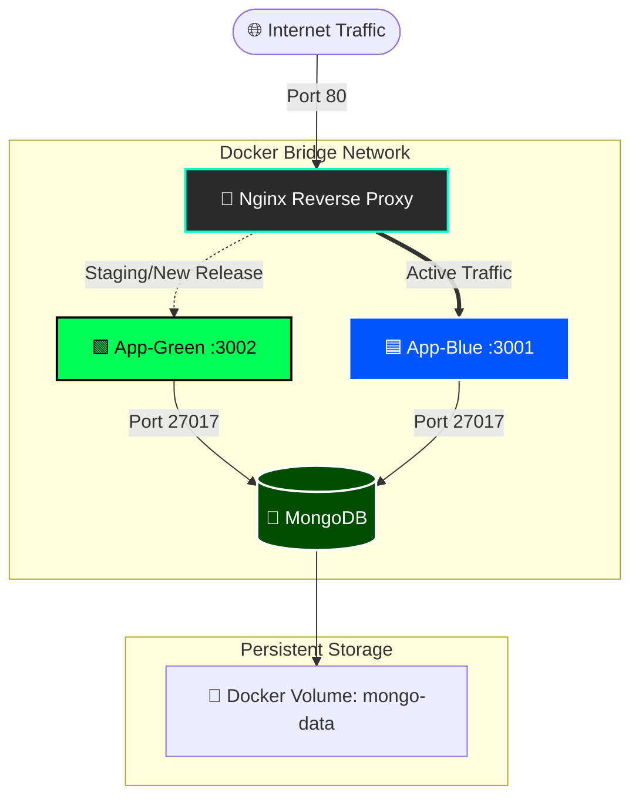
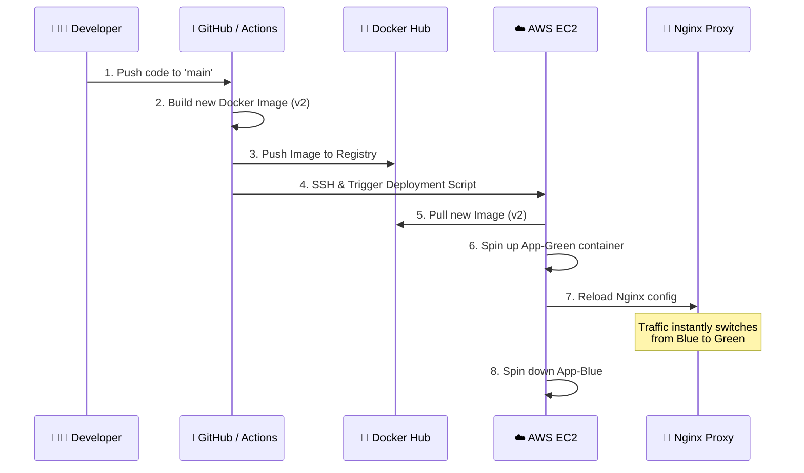

<div align="center">

# 🌌 Project Nexus: Multi-Container Cloud Architecture
**A Next-Generation, Zero-Downtime Application Infrastructure**

[]()
[]()
[]()
[]()
[]()

*Seamless. Scalable. Bulletproof.*

</div>

Welcome to the future of deployments. This repository isn't just a full-stack application; it is a **blueprint for modern cloud-native engineering**. It demonstrates a scalable, highly available architecture utilizing Docker, Nginx, and MongoDB, fully automated with CI/CD pipelines, Infrastructure as Code, and **zero-downtime Blue-Green deployments**.

---

## 🏗️ System Architecture

Our infrastructure is designed for high availability and instant rollbacks. Nginx acts as the gatekeeper, routing traffic dynamically between deployment states.



---

## ✨ Core Capabilities

- 🔵🟢 **Zero-Downtime Blue/Green Deployments:** Updates happen invisibly. We stand up the new version (Green) in the shadows, test it, and instantly redirect the Nginx router from the old version (Blue).
- 🔄 **Automated CI/CD Pipeline:** From push to production. GitHub Actions automates Docker image builds, registry pushes, and remote EC2 deployments.
- 📦 **100% Containerized:** Frontend, API, and Database are isolated in Docker, guaranteeing absolute consistency from local dev to AWS.
- 💾 **Stateful Persistence:** MongoDB is wired to persistent Docker Volumes. Containers may die, but your data is eternal.
- 🛠️ **Infrastructure as Code (IaC):** AWS EC2 instances are provisioned via **Terraform**, and configured dynamically via **Ansible**.

---

## 🧬 Tech Stack

| Domain | Technologies |
| :--- | :--- |
| **Frontend** | ⚛️ React.js, HTML5, CSS3 |
| **Backend** | 🟢 Node.js, Express.js |
| **Database** | 🍃 MongoDB (Dockerized) |
| **Orchestration**| 🐳 Docker, Docker Compose |
| **Routing** | 🚦 Nginx (Reverse Proxy & Load Balancing) |
| **CI/CD** | 🐙 GitHub Actions |
| **Infrastructure**| ☁️ AWS (EC2), 🏗️ Terraform, ⚙️ Ansible |

---

## 🌀 The Deployment Matrix (CI/CD Flow)

Watch how a simple code push evolves into a live production update without dropping a single packet:



---

## 🚀 Getting Started

Deploy this architecture locally in seconds.

### Prerequisites
- Docker & Docker Compose
- Git

### Ignition Sequence

1. **Clone the repository:**
   ```bash
   git clone https://github.com/anshtyagi-14/multi-container-app.git
   cd multi-container-app
   ```

2. **Verify Configuration:**
   Ensure `nginx.conf` and your frontend build (`./frontend/build`) are present in the root directory.

3. **Launch the Matrix:**
   Start the multi-container environment in detached mode:
   ```bash
   docker-compose up -d
   ```

4. **Monitor the Systems:**
   ```bash
   docker ps
   ```

---

<div align="center">
  <i>"Any sufficiently advanced technology is indistinguishable from magic." - Arthur C. Clarke</i><br>
  Built with ⚡️ by Ansh Tyagi
</div>
